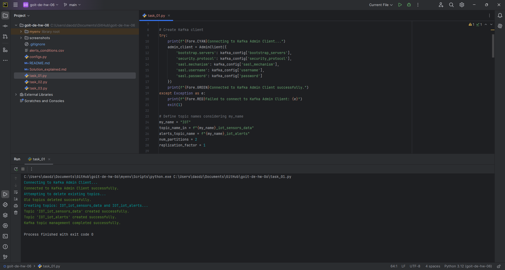
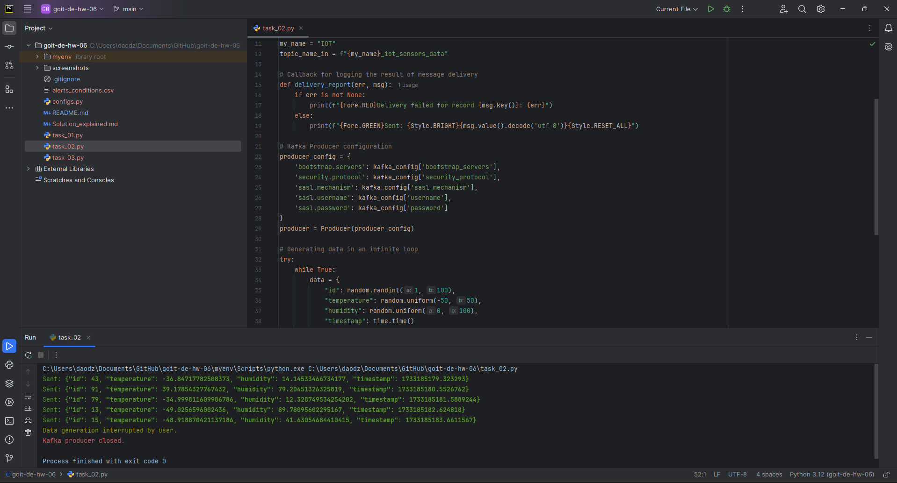
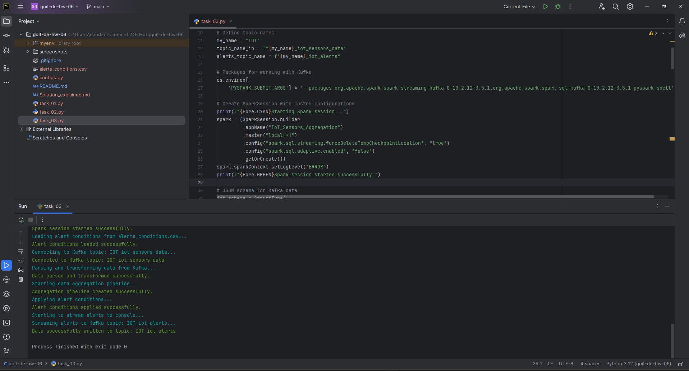
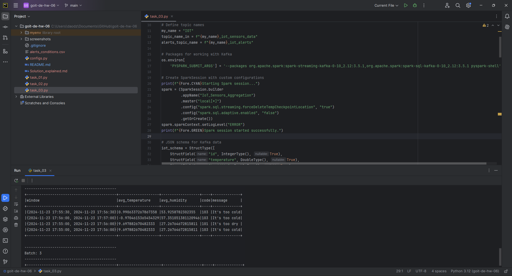

# Solution

## 1. Topics creation (task_01.py)

- **Purpose:** Creating two Kafka topics: `iot_sensors_data` (for sensor data) and `iot_alerts` (for alert messages).

##### Key Steps:

1. Connect to Kafka Admin Client using secure credentials (username, password).
2. Define topic parameters: 2 partitions and 1 replica.
3. Create the topics or log if they already exist.
4. Close the Kafka Admin Client.

Successfully created the iot_sensors_data and iot_alerts topics. The client was closed without errors.

## 2. Producer (task_02.py)

- **Purpose:** Generating random IoT sensor data and sending it to the iot_sensors_data Kafka topic.

##### Key Steps:

1. Create a Kafka Producer with authorization configuration.
2. Generate random sensor data (`id`, `temperature`, `humidity`, `timestamp`) every second.
3. Send the data in JSON format to the iot_sensors_data topic.
4. Log successfully sent messages (highlighted in green for visibility).
5. Handle user interrupts and close the producer.

Shows the generated and sent sensor data to the iot_sensors_data topic.

## 3. Spark Kafka (task_03.py)

- **Purpose:** Consume sensor data from Kafka, aggregate it, check alert conditions, and send alerts to the iot_alerts Kafka topic.

##### Key Steps:

1. Read data from the iot_sensors_data topic.
2. Parse and transform JSON data, convert the timestamp field to Spark TIMESTAMP type.
3. Aggregate the data using a sliding window (1 minute, with 30-second overlap).
4. Join the aggregated data with alert conditions (CSV file) and filter based on the specified thresholds.
5. Stream alert messages to the console and send them to the iot_alerts topic.

This screenshot shows how Spark successfully consumes data, aggregates it, and generates alerts.

This screenshot demonstrates the processing result: alerts displayed on the console and further processed batches.

